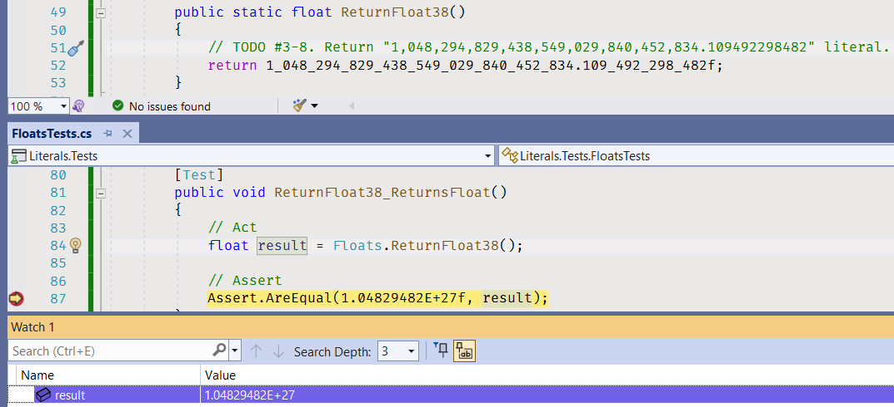
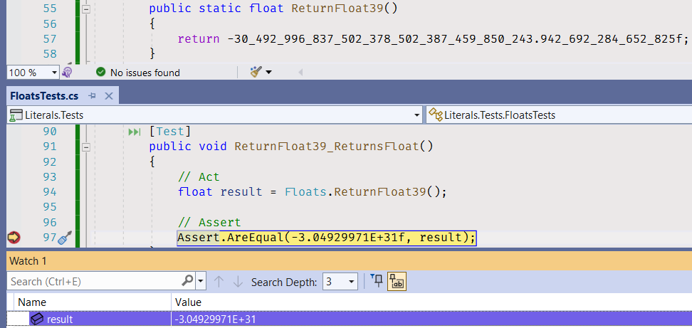
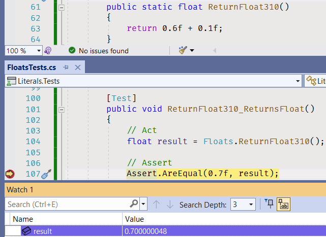
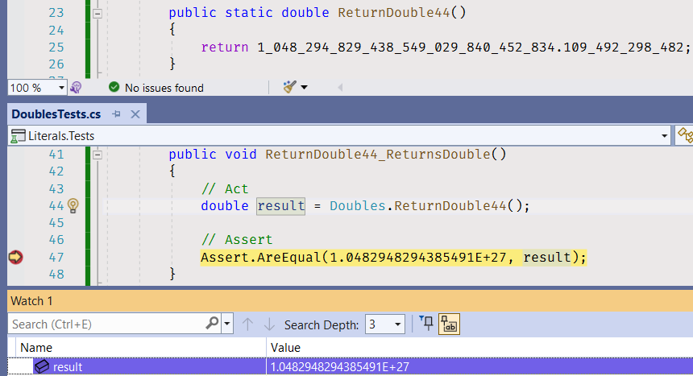
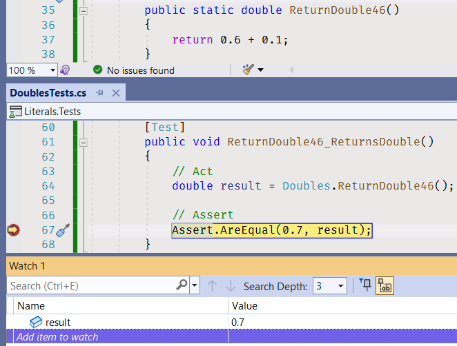
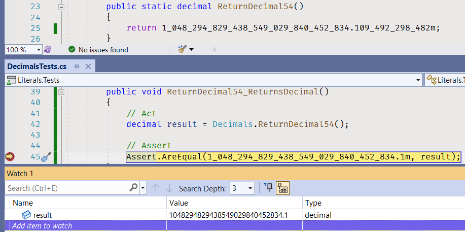
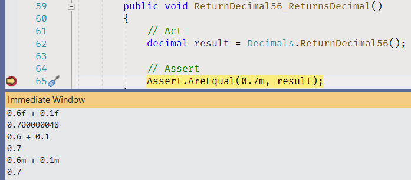

# Literals

A beginner level task for practicing number, string and boolean literals.

Estimated time to complete the task - 2h.

The task requires .NET 6 SDK.


## Task Description

The task has five sections with small sub-tasks in the code files.

Read [Built-in value types](https://docs.microsoft.com/en-us/dotnet/csharp/language-reference/builtin-types/value-types#built-in-value-types) section.


### Integer Literals

Read [Integral numeric types](https://docs.microsoft.com/en-us/dotnet/csharp/language-reference/builtin-types/integral-numeric-types) article.


#### _int_ and _uint_ data types

Open [Integers.cs](Literals/Integers.cs) file, and implement all methods using the information from the table below.

| Method Name      | Number         | Literal Type | Suffix |
|------------------|----------------|--------------|--------|
| ReturnInteger11  | 0              | Decimal      |        |
| ReturnInteger12  | 1              | Decimal      |        |
| ReturnInteger13  | -1             | Decimal      |        |
| ReturnInteger14  | 2,147,483,647  | Decimal      |        |
| ReturnInteger15  | -2,147,483,648 | Decimal      |        |
| ReturnInteger16  | 1              | Decimal      | u      |
| ReturnInteger17  | 3,2767         | Decimal      | u      |
| ReturnInteger18  | 2,147,483,647  | Decimal      | u      |

Start with the first method - [ReturnInteger11](Literals/Integers.cs#L7):

```cs
public static int ReturnInteger11()
{
    // TODO #1-1. Return "0" literal.
    throw new NotImplementedException();
}
```

The [throw](https://docs.microsoft.com/en-us/dotnet/csharp/language-reference/keywords/throw) keyword signals the occurence of an exception during program execution. In this method _throw new NotImplementedException()_ code signals that the method is not implemented.

Replace the _throw new NotImplementedException()_ code with _return 0_ statement:

```cs
public static int ReturnInteger11()
{
    // TODO #1-1. Return "0" literal.
    return 0;
}
```

The [return](https://docs.microsoft.com/en-us/dotnet/csharp/language-reference/keywords/return) statement terminates the method execution and returns "0" as a return value. "0" is the [decimal literal](https://docs.microsoft.com/en-us/dotnet/csharp/language-reference/builtin-types/integral-numeric-types#integer-literals).

Remove the TODO comment:

```cs
public static int ReturnInteger11()
{
    return 0;
}
```

Sonar will raise an [#1135 issue](https://rules.sonarsource.com/csharp/RSPEC-1135) for each TODO comment during a task check.

The [digit separator](https://docs.microsoft.com/en-us/dotnet/csharp/language-reference/builtin-types/integral-numeric-types#integer-literals) may improve the readability of large numeric literals. Use the digit separator symbol in this task for number literals with *more then 3 digits*.

```cs
public static int ReturnInteger14()
{
    return 2_147_483_647;
}
```

To specify the number literal is _unsigned_ use **u** or **U** suffixes:

```cs
public static uint ReturnInteger16()
{
    return 1u;
}
```

In your own code you can often skip these suffixes, because the compiler will understand that the literal is unsigned. But for the sake of learning we ask you to add suffixes in this task.


#### _long_ and _ulong_ data types

Open [LongIntegers.cs](Literals/LongIntegers.cs) file, and implement all methods using the information from the table below.

| Method Name          | Number                     | Literal Type | Suffix |
|----------------------|----------------------------|--------------|--------|
| ReturnLongInteger21  | 4,956,185,095,298,947,214  | Decimal      | L      |
| ReturnLongInteger22  | -1,280,010,762,458,239,942 | Decimal      | L      |
| ReturnLongInteger23  | -945,783,496,234,828,465   | Decimal      | L      |
| ReturnLongInteger24  | 16,269,823,234,523,742,845 | Decimal      | L      |
| ReturnLongInteger25  | 9,223,372,036,854,775,807  | Hexadecimal  | L      |
| ReturnLongInteger26  | 773,738,404,492,802,748    | Hexadecimal  | L      |
| ReturnLongInteger27  | 17,977,307,477,258,691,517 | Hexadecimal  | L      |
| ReturnLongInteger28  | 14,193,065,825,095,688,383 | Hexadecimal  | uL     |
| ReturnLongInteger29  | 4,100,761,908,933,204,629  | Binary       | L      |
| ReturnLongInteger210 | 13,645,102,583,813,967,509 | Binary       | uL     |
| ReturnLongInteger211 | 6,148,914,691,236,517,205  | Binary       | L      |
| ReturnLongInteger212 | 18,446,744,073,709,551,615 | Binary       | uL     |

Use **L** suffix to specify that a number literal is a _long integer_:

```cs
public static long ReturnLongInteger21()
{
    return 4_956_185_095_298_947_214L;
}
```

If you will put **l** suffix you will get [CS0078 warning](https://docs.microsoft.com/en-us/dotnet/csharp/misc/cs0078).


In methods with _Hexadecimal_ literal type use [hexadecimal literals](https://docs.microsoft.com/en-us/dotnet/csharp/language-reference/builtin-types/integral-numeric-types#integer-literals). See [Convert Numbers](convert-numbers.md) tutorial for more information on how to convert decimal numbers.

```cs
public static long ReturnLongInteger25()
{
    return 0x7FFF_FFFF_FFFF_FFFFL;
}
```

In methods with _Binary_ literal types use [binary literals](https://docs.microsoft.com/en-us/dotnet/csharp/language-reference/builtin-types/integral-numeric-types#integer-literals). See [Convert Numbers](convert-numbers.md) tutorial for more information on how to convert decimal numbers.

```cs
public static long ReturnLongInteger29()
{
    return 0b0011100011101000110101010011101010111010011010101001101010010101L;
}
```


### Real Literals

Read [Floating-point numeric types](https://docs.microsoft.com/en-us/dotnet/csharp/language-reference/builtin-types/floating-point-numeric-types) article.


### _float_ data type

Open [Floats.cs](Literals/Floats.cs) file, and implement all methods using the information from the table below.

| Method Name    | Number                                                          |
|----------------|-----------------------------------------------------------------|
| ReturnFloat31  | 0.0                                                             |
| ReturnFloat32  | 1.01                                                            |
| ReturnFloat33  | -0.01                                                           |
| ReturnFloat34  | 1,048,294,829,438,549,029,840,452,834.109492298482              |
| ReturnFloat35  | -30,492,996,837,502,378,502,387,459,850,243.942692284652825     |
| ReturnFloat36  | -0.000000000000000000000000000000000000000123                   |
| ReturnFloat37  | -1.23E-40                                                       |
| ReturnFloat38  | 1,048,294,829,438,549,029,840,452,834.109492298482              |
| ReturnFloat39  | -30,492,996,837,502,378,502,387,459,850,243.942692284652825     |
| ReturnFloat310 | 0.6 + 0.1                                                       |

Use the **f** or **F** suffix for literals of _float_ type:

```cs
public static float ReturnFloat31()
{
    return 0.0f;
}
```

_-0.000000000000000000000000000000000000000123_ and _-1.23E-40_ are the same numbers, but the last number is in [scientific notation](https://en.wikipedia.org/wiki/Scientific_notation).


After completing [ReturnFloat38](Literals/Floats.cs#L49) navigate to [ReturnFloat38_ReturnsFloat](Literals.Tests/FloatsTests.cs#L85) unit test and take a look at the float literal that unit tests uses for comparing with the method result.

_1.04829482E+27_ is a scientific notation for _1,048,294,820,000,000,000,000,000,000_ number. This number does't equal to what you return from your _ReturnLongInteger38_ method. This happens because of the limitations of data format the program uses to store a floating-point number. The value is rounded automatically because the number is too huge.



The same is true for the number in [ReturnFloat39](Literals/Floats.cs#L55) method.



Also, floating-point numbers has accuracy issues (see [Accuracy Problems](https://en.wikipedia.org/wiki/Floating-point_arithmetic#Accuracy_problems)), and floating-point operations cannot precisely represent true arithmetic operations.

```cs
public static float ReturnFloat310()
{
    return 0.6f + 0.1f;
}
```

The result of the expression wouldn't be equal to _0.7_:



Replace the expression with the expression result to return the correct value from the [ReturnFloat310](Literals/Floats.cs#L61) method.

```cs
public static float ReturnFloat310()
{
    return 0.7f;
}
```


### _double_ data type

Open [Doubles.cs](Literals/Doubles.cs) file, and implement all methods using the information from the table below.

| Method Name    | Number                                                          |
|----------------|-----------------------------------------------------------------|
| ReturnDouble41 | 0.0                                                             |
| ReturnDouble42 | 1.01                                                            |
| ReturnDouble43 | -0.01                                                           |
| ReturnDouble44 | 1,048,294,829,438,549,029,840,452,834.109492298482              |
| ReturnDouble45 | -30,492,996,837,502,378,502,387,459,850,243.942692284652825     |
| ReturnDouble46 | 0.6 + 0.1                                                       |

After completing [ReturnDouble44](Literals/Doubles.cs#L23) navigate to [ReturnDouble44_ReturnsDouble](Literals.Tests/DoublesTests.cs#L45) unit test and take a look at the _double_ literal that unit tests uses for comparing with the method result.  Compare the method result with the result of _ReturnFloat38_ method.



_1.0482948294385491E+27_ is a scientific notation for _1,048,294,829,438,549,100,000,000,000.0_ number. _double_ data type has higher precision, but the number is still truncated.

After completing [ReturnDouble45](Literals/Doubles.cs#L29) navigate to [ReturnDouble45_ReturnsDouble](Literals.Tests/DoublesTests.cs#L55) unit test and take a look at the _double_ literal that unit tests uses for comparing with the method result. Compare the method result with the result of _ReturnFloat39_ method.

Compare the result of sum expression in [ReturnDouble46](Literals/Doubles.cs#L23) with _double_ literal in [ReturnDouble46_ReturnsDouble](Literals.Tests/DoublesTests.cs#L65):



_double_ data type is much more accurate than _float_, therefore the expression result is equals to _0.7_.


### _decimal_ data type

Open [Decimals.cs](Literals/Decimals.cs) file, and implement all methods using the information from the table below.

| Method Name     | Number                                                  |
|-----------------|---------------------------------------------------------|
| ReturnDecimal51 | 0.0                                                     |
| ReturnDecimal52 | 0.0000001                                               |
| ReturnDecimal53 | -10,000.0000000001                                      |
| ReturnDecimal54 | 1,048,294,829,438,549,029,840,452,834.109492298482      |
| ReturnDecimal55 | -30,492,996,837,502,378,502,387,459,850.942692284652825 |
| ReturnDecimal56 | 0.6 + 0.1                                               |

After completing [ReturnDecimal54](Literals/Decimals.cs#L23) navigate to [ReturnDecimal54_ReturnsDecimal](Literals.Tests/DecimalsTests.cs#L45) unit test and take a look at the _decimal_ literal that unit tests uses for comparing with the method result. Compare the method result with the result of _ReturnFloat38_ and _ReturnDouble44_ methods.



After completing [ReturnDecimal55](Literals/Decimals.cs#L29) navigate to [ReturnDecimal55_ReturnsDecimal](Literals.Tests/DecimalsTests.cs#L55) unit test and take a look at the _decimal_ literal that unit tests uses for comparing with the method result. Compare the method result with the result of _ReturnFloat39_ and _ReturnDouble45_ methods.

Compare the result of sum expression in [ReturnDecimal56](Literals/Decimals.cs#L35) with _double_ literal in [ReturnDouble46_ReturnsDouble](Literals.Tests/DecimalTests.cs#L65).


### Accuracy

Use [Immediate window](https://docs.microsoft.com/en-us/visualstudio/ide/reference/immediate-window) to calculate expressions for data types from the table below.

| Expression   | float result | double result      | decimal result |
---------------|--------------|--------------------|----------------|
| 0.6 + 0.1    | 0.700000048  | 0.7                | 0.7            |
| 1.2 + 0.1    |              |                    |                |
| 1.7 + 0.1    |              |                    |                |
| 2.55 * 100.0 |              |                    |                |

(You don't have to put the result table in your repository.)

1. Toggle a breakpoint in a unit test (you can use any unit test from the project).


2. Debug the unit test you toggled breakpoint in.


2. Open Immediate window.


3. Put expression to the Immediate window, and press Enter key.




### Boolean Literals

Read [bool](https://docs.microsoft.com/en-us/dotnet/csharp/language-reference/builtin-types/bool) article, open [Bools.cs](Literals/Bools.cs) file, and implement all methods using the information from the table below.

| Method Name  | Value |
|--------------|-------|
| ReturnBool61 | true  |
| ReturnBool62 | false |

There are only two possible literals for _bool_ data type - _true_ and _false_.


### String Literals

Read [Declaring and Initializing Strings](https://docs.microsoft.com/en-us/dotnet/csharp/programming-guide/strings/#declaring-and-initializing-strings) section, open [Strings.cs](Literals/Strings.cs) file, and implement all methods using the information from the table below.

| Method Name     | Value                                                                                                                       | Literal Type | Add    |
|-----------------|-----------------------------------------------------------------------------------------------------------------------------|--------------|--------|
| ReturnString71  | Hello, world!                                                                                                               |              |        |
| ReturnString72  | Lorem ipsum dolor sit amet, consectetur adipiscing elit, sed do eiusmod tempor incididunt ut labore et dolore magna aliqua. |              |        |
| ReturnString73  | 4,956,185,095,298,947,214                                                                                                   | Decimal      | Suffix |
| ReturnString74  | 840,452,834.1094                                                                                                            | Decimal      | Suffix |
| ReturnString75  | 187723572702975                                                                                                             | Hexadecimal  | Prefix |
| ReturnString76  | 81985529216486895                                                                                                           | Hexadecimal  | Prefix |
| ReturnString77  | 12379809047621975535                                                                                                        | Hexadecimal  | Prefix |
| ReturnString78  | 9223090566172966912                                                                                                         | Binary       | Prefix |
| ReturnString79  | 6148914691236517205                                                                                                         | Binary       | Prefix |
| ReturnString710 | 1148435428713435120                                                                                                         | Binary       | Prefix |

In [ReturnString71](Literals/Strings.cs#L5) and [ReturnString72](Literals/Strings.cs#L11) methods return a value as a string literal.

```cs
public static string ReturnString71()
{
    return "Hello, world!";
}
```

In [ReturnString73](Literals/Strings.cs#L17) method return a string that contains an unsigned long literal. Add relevant suffixes, but don't add digit separators.

In [ReturnString74](Literals/Strings.cs#L23) method return a string that contains a decimal literal. Add relevant suffix, but don't add digit separators.

In [ReturnString75](Literals/Strings.cs#L29) method return a string that contains a hexadecimal literal. Don't add digit separators.

In [ReturnString78](Literals/Strings.cs#L47) method return a string that contains a binary literal. Don't add digit separators.


## Fix Compiler Issues

Additional style and code checks are enabled for the projects in this solution to help you maintaining consistency of the project source code and avoiding silly mistakes. [Review the Error List](https://docs.microsoft.com/en-us/visualstudio/ide/find-and-fix-code-errors#review-the-error-list) in Visual Studio to see all compiler warnings and errors.

If a compiler error or warning message is not clear, [review errors details](https://docs.microsoft.com/en-us/visualstudio/ide/find-and-fix-code-errors#review-errors-in-detail) or google the error or warning code to get more information about the issue.


## Task Checklist

1. Rebuild the solution.
1. Fix all compiler warnings and errors.
1. Run all unit tests, make sure all unit tests completed successfully.
1. Review all changes, make sure the only code files (.cs) in Literals project have changes. No changes in project files (.csproj) or in Literals.Tests project.
1. Stage your changes, and create a commit.
1. Push your changes to remote repository.


## See also

* C# Language Reference
  * [Integral numeric types](https://docs.microsoft.com/en-us/dotnet/csharp/language-reference/builtin-types/integral-numeric-types)
  * [Floating-point numeric types](https://docs.microsoft.com/en-us/dotnet/csharp/language-reference/builtin-types/floating-point-numeric-types)
  * [bool](https://docs.microsoft.com/en-us/dotnet/csharp/language-reference/builtin-types/bool)
  * [return](https://docs.microsoft.com/en-us/dotnet/csharp/language-reference/keywords/return)
  * [throw](https://docs.microsoft.com/en-us/dotnet/csharp/language-reference/keywords/throw)
* C# Programming Guide
  * [Strings](https://docs.microsoft.com/en-us/dotnet/csharp/programming-guide/strings)
* .NET API
  * [Int32 Struct](https://docs.microsoft.com/en-us/dotnet/api/system.int32) 
  * [Int64 Struct](https://docs.microsoft.com/en-us/dotnet/api/system.int64)
  * [Single Struct](https://docs.microsoft.com/en-us/dotnet/api/system.single)
  * [Double Struct](https://docs.microsoft.com/en-us/dotnet/api/system.double)
  * [Boolean Struct](https://docs.microsoft.com/en-us/dotnet/api/system.boolean)
  * [String Class](https://docs.microsoft.com/en-us/dotnet/api/system.string)
